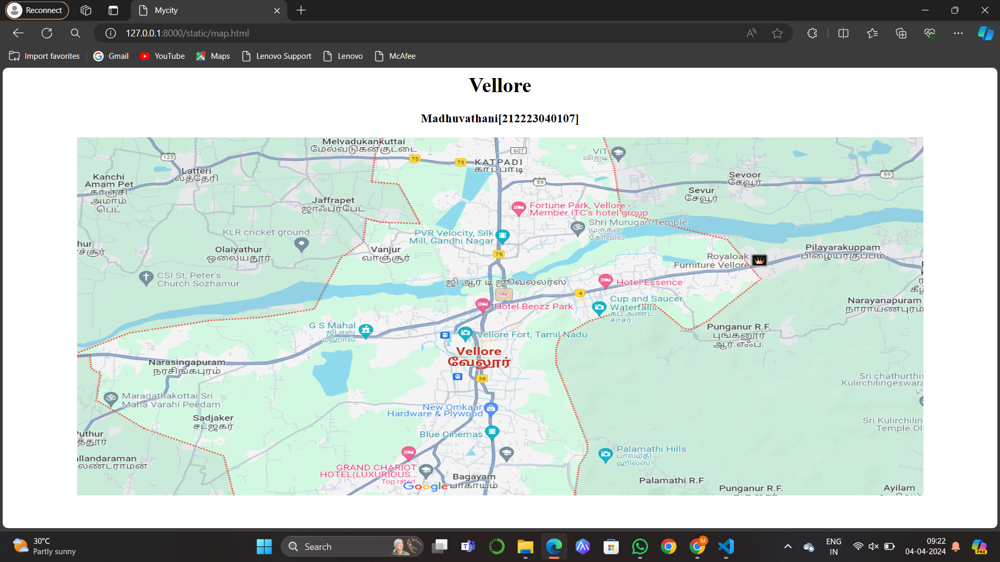
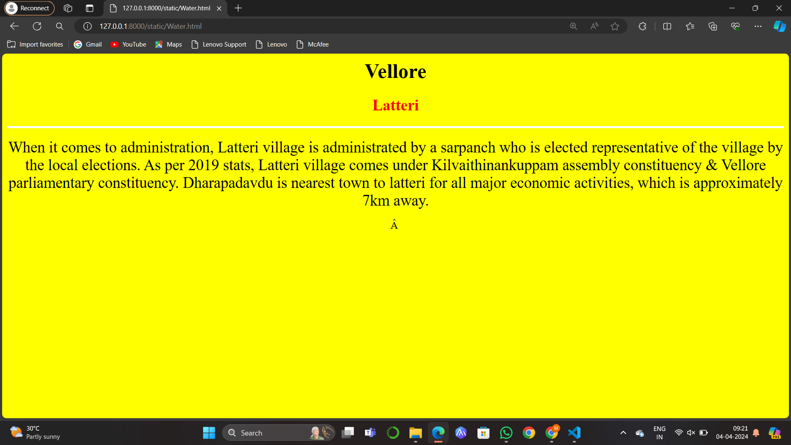
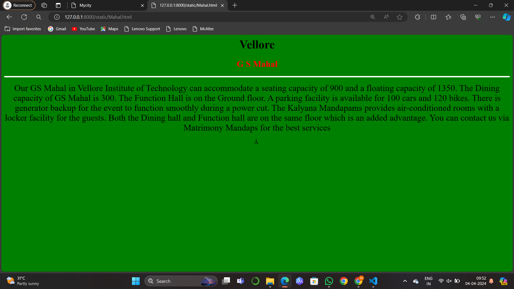
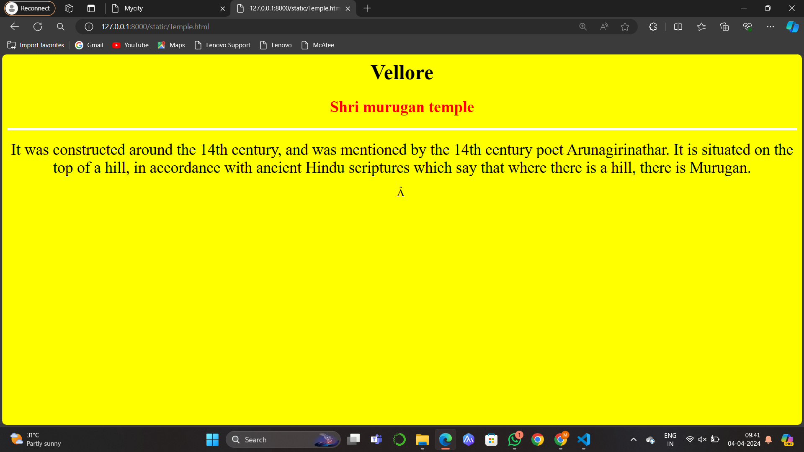
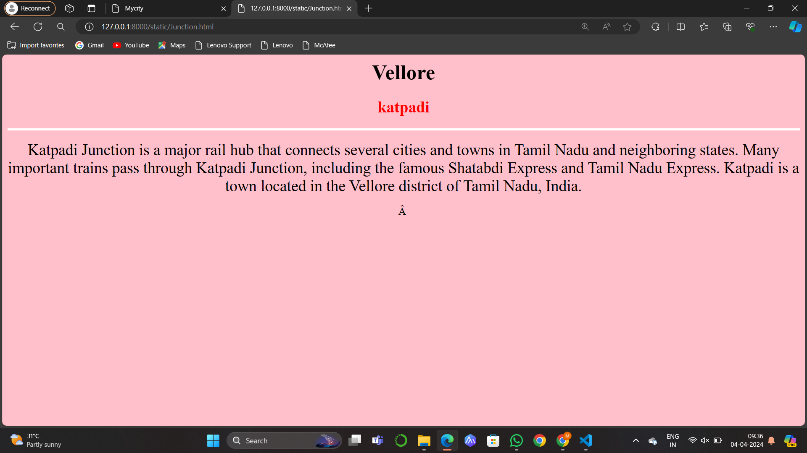
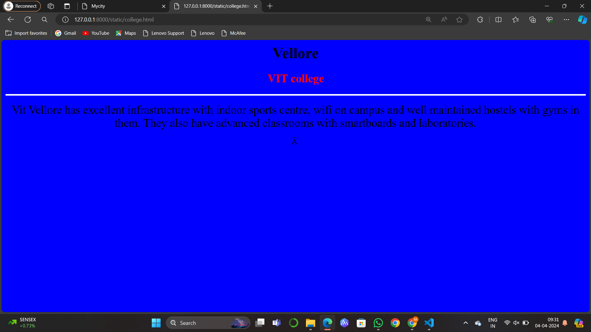

# Ex04 Places Around Me
## Date: 04.04.2024

## AIM
To develop a website to display details about the places around my house.

## DESIGN STEPS

### STEP 1
Create a Django admin interface.

### STEP 2
Download your city map from Google.

### STEP 3
Using ```<map>``` tag name the map.

### STEP 4
Create clickable regions in the image using ```<area>``` tag.

### STEP 5
Write HTML programs for all the regions identified.

### STEP 6
Execute the programs and publish them.

## CODE
```
map.html
<html>
    <title>Mycity</title>
    <body bgcolor="white">
        <h1 align="center"><font color="black">Vellore</font></h1>
        <h3 align="center">
            <font color="black">Madhuvathani[212223040107]</font></h3>
        <center>
            
            <map name="image-map">
                <area shape="rect" coords="254,113,153,59" href="Water.html" title="Latteri">     
                <area shape="rect" coords="399,424,500,486" href="Mahal.html" title="G S Mahal">
                <area shape="rect" coords="855,223,1060,180" href="Temple.html" title="Shri murugan temple">
                <area shape="rect" coords="649,24,813,102" href="Junction.html" title="katpadi">
                <area shape="rect" coords="961,89,853,11" href="College.html" title="VIT college">

            </map>
        </center>
    </body>
</html>

Water.html
<html>
    <h1 align="center">
        <font face="Times New Roman" color="black" size="6">Vellore</font>
    </h1>
    <h3 align="center">
        <font face="Times New Roman" color="red" size="5.5">Latteri</font>
    </h3>
    <body bgcolor="yellow" align="center">
        <hr size="4" color="white">
        <p align="center">
        <font face="Times New Roman" size="5">
            When it comes to administration, Latteri village is administrated by a sarpanch who is elected representative of the village by the local elections. As per 2019 stats, Latteri village comes under Kilvaithinankuppam assembly constituency & Vellore parliamentary constituency. Dharapadavdu is nearest town to latteri for all major economic activities, which is approximately 7km away.
        </font>
        </p>
    </body>
</html>

Mahal.html
<html>
    <h1 align="center">
        <font face="Times New Roman" color="black" size="6">Vellore</font>
    </h1>
    <h3 align="center">
        <font face="Times New Roman" color="red" size="5.5">G S Mahal</font>
    </h3>
    <body bgcolor="green" align="center">
        <hr size="4" color="white">
        <p align="center">
        <font face="Times New Roman" size="5">
            Our GS Mahal in Vellore Institute of Technology can accommodate a seating capacity of 900 and a floating capacity of 1350. The Dining capacity of GS Mahal is 300. The Function Hall is on the Ground floor. A parking facility is available for 100 cars and 120 bikes. There is generator backup for the event to function smoothly during a power cut. The Kalyana Mandapams provides air-conditioned rooms with a locker facility for the guests. Both the Dining hall and Function hall are on the same floor which is an added advantage. You can contact us via Matrimony Mandaps for the best services 
        </font>
        </p>
    </body>
</html>

Temple.html
<html>
    <h1 align="center">
        <font face="Times New Roman" color="black" size="6">Vellore</font>
    </h1>
    <h3 align="center">
        <font face="Times New Roman" color="red" size="5.5">Shri murugan temple</font>
    </h3>
    <body bgcolor="yellow" align="center">
        <hr size="4" color="white">
        <p align="center">
        <font face="Times New Roman" size="5">
            It was constructed around the 14th century, and was mentioned by the 14th century poet Arunagirinathar. It is situated on the top of a hill, in accordance with ancient Hindu scriptures which say that where there is a hill, there is Murugan.
        </font>
        </p>
    </body>
</html>

Junction.html
<html>
    <h1 align="center">
        <font face="Times New Roman" color="black" size="6">Vellore</font>
    </h1>
    <h3 align="center">
        <font face="Times New Roman" color="red" size="5.5">katpadi</font>
    </h3>
    <body bgcolor="pink" align="center">
        <hr size="4" color="white">
        <p align="center">
        <font face="Times New Roman" size="5">
            Katpadi Junction is a major rail hub that connects several cities and towns in Tamil Nadu and neighboring states. Many important trains pass through Katpadi Junction, including the famous Shatabdi Express and Tamil Nadu Express. Katpadi is a town located in the Vellore district of Tamil Nadu, India.
        </font>
        </p>
    </body>
</html>

College.html
<html>
    <h1 align="center">
        <font face="Times New Roman" color="black" size="6">Vellore</font>
    </h1>
    <h3 align="center">
        <font face="Times New Roman" color="red" size="5.5">VIT college</font>
    </h3>
    <body bgcolor="blue" align="center">
        <hr size="4" color="white">
        <p align="center">
        <font face="Times New Roman" size="5">
            Vit Vellore has excellent infrastructure with indoor sports centre, wifi on campus and well maintained hostels with gyms in them. They also have advanced classrooms with smartboards and laboratories.  
        </font>
        </p>
    </body>
</html>

```

## OUTPUT














## RESULT
The program for implementing image maps using HTML is executed successfully.
